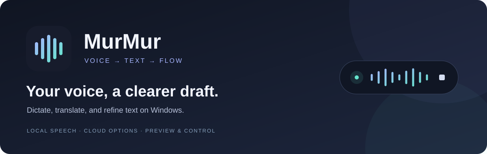

<div align="center">



**A compact Windows voice assistant for dictation, translation, and text editing.**

[](pyproject.toml)
[](#quick-start)
[](pyproject.toml)
[](LICENSE)
[](#providers)

**English** · [简体中文](README.zh-CN.md)

[Website](https://murmur.icalculate.chatgpt.site)

[Quick start](#quick-start) · [Features](#features) · [Providers](#providers) · [Privacy](#privacy-and-data) · [Development](#development)

</div>

---

**Current workspace (2026-10-04):** use `D:\LocalProjects\MurMur` for launch, development and tests. Speech models live in `models`, application settings/history/recordings in `data`, and native ASR runtimes in `runtimes`. The retired Dropbox copy is no longer needed for startup. Double-click `Start-MurMur.cmd` for a daily launch using the existing environment. See [local launch instructions](LOCAL_RUN.md) and [storage/migration notes](docs/LOCAL_STORAGE.md).

MurMur turns two key presses into a short voice session: press to start, speak, then press again for a cleaner draft. A floating capsule stays close to your work, while the main window brings together activity insights, searchable history, a personal dictionary, and service settings.

New profiles use local SenseVoice speech recognition with Demo mode off. You can also choose Paraformer, Fun-ASR-Nano, Qwen3-ASR or a cloud provider. Keep text processing local with Ollama, or use an OpenAI-compatible endpoint such as DeepSeek. Preview results and keep control over what reaches your documents.

> **Project status:** v0.4.7 is the current Beta iteration; installer distribution remains blocked. There is currently no distributable portable EXE or binary ZIP: a previous portable build was blocked by the development environment's organization security scanner. See the [validation log](docs/VALIDATION.md) and [build notice](docs/PORTABLE_SECURITY_BLOCK.txt). The build script retains that block pending review.

## Features

| Feature | What it offers |
| --- | --- |
| **Dictation** | Press Right Alt or F8 once to start, then again to finish. Hold mode remains available in Settings. |
| **Translation and editing** | Voice translation; selected-text polishing, translation, summarization, expansion, and custom editing. |
| **Local or cloud** | Four offline speech models, DirectML / Vulkan GPU acceleration, DashScope, Alibaba Speech NLS, and local or online text models. |
| **Floating capsule** | A 224 × 44 capsule with larger confirmation and close controls. Entry, state transitions, expansion and exit have configurable motion; clear confirmed delivery closes quietly. |
| **Personal vocabulary** | Hotwords, literal replacement rules, and local term suggestions with examples from your history. |
| **Activity and history** | Calendar insights, searchable history, JSON/CSV export, and configurable retention. |
| **Service settings** | Provider presets, advanced options, shortcut checks, and separate speech/text connection tests. |
| **Preview and control** | Selection edits require confirmation; uncertain targets fall back to preview. |

The English dark interface includes **Home**, **History**, **Dictionary**, and **Settings**. Settings uses a category sidebar and a persistent **Save changes** footer. **Services** opens a compact, scroll-free overview of **Speech to Text**, **Polish**, and **Ask Anything**. Each module has a model menu, connection check, and its own **Advanced settings** subpage. Unsaved changes stay intact when moving between these pages. Home combines compact insights, a square-cell activity calendar, and your configured shortcut keys. Changed history entries include **Compare original and result**, including short texts; details retain the complete original transcript, processed output and Ask selection separately.

The main window is fixed at **920 × 680** logical pixels; the text editor is **680 × 440**. MurMur's own dialogs cannot be manually resized or maximized. Detailed settings scroll within the fixed window; the Services overview fits without scrolling. Closing the main window keeps MurMur in the tray; choose **Quit MurMur** to exit.

A failed rewrite keeps **Copy**, **Review**, and **Dismiss** in the result bubble. **Review** opens the original transcript in the existing editor; generating a refined draft uses the same original-language, quotation, term and explicit-correction checks as dictation. Balanced quotations are frozen before the request and restored exactly; a narrow weekday check rejects clear schedule/deadline changes. Unique mixed-language technical phrases and clear weekday relations are also frozen. Narrow checks reject observed completed-action and added-cause changes; these checks do not prove complete semantic fidelity.

Editing a floating result opens **Edit result**, with copying available and selection replacement hidden. Generating another version preserves that context. If history cannot be saved, MurMur keeps the current text available and restores the controls. History exports replace an existing file only after the new export is written completely.

## Quick start

### 1. Install and launch

For a first installation from GitHub, install Python 3.12+, uv, Git and GitHub CLI, then run the commands below. Application data, models and runtimes currently use this fixed directory; those private files and downloaded resources are excluded from the repository.

```powershell
gh repo clone Chauncy-Du/murmur 'D:\LocalProjects\MurMur'
Set-Location 'D:\LocalProjects\MurMur'
uv sync --locked
.\Start-MurMur.cmd
```

For this installed workspace, double-click **`D:\LocalProjects\MurMur\Start-MurMur.cmd`**. It uses the existing `.venv` and `run.py` without syncing or downloading dependencies. Quit any previous instance from its tray menu first.

The equivalent PowerShell command is:

```powershell
Set-Location 'D:\LocalProjects\MurMur'
.\scripts\start.ps1 -SkipSync
```

When installing or updating dependencies, run `.\scripts\start.ps1` without `-SkipSync`; it runs `uv sync --locked` before launch. That mode needs Windows 10/11, Python 3.12 or newer and [uv](https://docs.astral.sh/uv/). Live recording needs a microphone. You can also run `uv run --no-sync murmur` with the existing environment.

### 2. Prepare the local speech model

A fresh profile selects **Local speech model · offline → SenseVoice Small · multilingual (default)** with **CPU · compatible** and **Demo mode** off. In **Settings → Services → Speech to Text → Advanced**, choose a model and **Run on**, then click **Download model** or choose an existing compatible model folder. Click **Load & test**, then **Save changes**. No speech API key is required. Models are downloaded only when you request installation.

Existing saved speech providers and Demo preferences remain explicit. To explore simulated results, enable **Settings → General → Demo mode**, save, then use **Record to preview**; Demo results can be previewed or copied manually.

### 3. Configure real recording

1. In **Settings → Services → Speech to Text → Advanced**, choose **Local speech model · offline**, then one of the four local models and CPU / GPU. For an online speech provider, enter its required credentials instead.
2. Download the selected offline model, or choose a compatible model folder.
3. Choose a model in the **Polish** menu for refinement, translation or editing. Use **Advanced** for custom endpoints, credentials and detailed parameters.
4. Use **Load & test** for offline speech and **Test connection** for text or online speech, then **Save changes**. A successful test does not save changes automatically.
5. If you previously enabled Demo, turn it off in **Settings → General** and save.
6. Focus an editable text field, press **Right Alt** or **F8** once, wait for Recording, speak, and press again to finish.

For fully local dictation, select **Local speech model · offline** and disable **Refine dictated text**, or configure an installed text model at a loopback endpoint. Refinement, translation and editing follow your separate text-provider settings.

## Keyboard shortcuts

| Default | Action |
| --- | --- |
| **Right Alt / F8** | Press once to start dictation; press again to finish. |
| **Alt + Shift** | Voice translation. |
| **Right Alt + Space** | Start Ask Anything; press Right Alt again to finish. |
| **Left Alt + Space** | Capture selected text for preview and editing. |
| **Esc** | Cancel the current operation. |

Shortcuts and hold/toggle behavior are configurable. If another application uses Alt + Space, try **Ctrl + Shift + Space**. Disabling the dictation shortcut also disables F8; use **Home → Record to preview** to start recording.

**Settings → General → Show results only when needed** is enabled by default. Clear dictation and translation finish quietly after the original input target is rechecked and complete insertion is confirmed. Uncertain wording, an unavailable input target or unconfirmed insertion opens the result bubble for **Edit** or **Copy**. Successful Copy closes the bubble; copying from **Edit result** also closes that editor. Original transcripts and final prose remain in History. **Record to preview** and Demo retain their preview. Disable the setting to restore results after every operation. Selection editing starts with a preview; **Replace** rechecks the original target and selection before writing.

**Settings → Appearance** configures the display, eight anchors, edge spacing, capsule width/height, result width, and optional mouse following with pointer spacing. Following uses the pointer’s display, flips sides at screen edges and pauses on hover so buttons stay clickable. Fixed bottom placement remains the default. Entry and exit offer **Pop / Slide / Fade / None**; state transitions and voice-bar motion can be disabled separately, with a 120–500 ms duration. **Preview animation** plays synthetic recording, processing and result states using unsaved choices, without microphone capture or service requests. Save to apply. Legacy narrow sizes move to the new default; other valid appearance preferences remain.

The capsule combines actual workflow milestones with smooth estimated progress while processing. Percentages are estimates, not server-reported model progress; only validated completion reaches 100%. Task-specific stage hints describe the waiting interface and do not add model requests. See [estimated progress](docs/ESTIMATED_PROGRESS.md). Results that require review or manual copying expand over 240 ms. Clear, confirmed delivery closes quietly. Starting another recording or cancelling invalidates older animation and insertion callbacks.

Wording review metadata arrives in the same refinement or translation request, without an additional model call or changing the selected model. It reports unresolved wording, references or correction scope, rather than a calibrated speech-accuracy percentage. Missing or invalid assessment metadata preserves the prose for review. Supported native Windows text fields receive direct insertion without changing the clipboard; other verifiable fields use the existing paste transaction. Unverifiable inputs fall back to manual Copy without automatically overwriting the clipboard.

Speech or refinement failures stay in a compact error bubble. Recovered original text is available for manual **Copy** or **Review**; errors never automatically copy or paste partial text. If no transcript was captured, only the diagnostic and **Dismiss** are shown. An already open selection editor retains its error in place.

## Providers

**Settings → Services** has three compact modules: **Speech to Text**, **Polish**, and **Ask Anything**. Each has a model menu, status, **Test** and **Advanced**. The overview fits without scrolling; detailed parameters are in separate subpages. With **Auto**, the actual model appears only after a successful check. Choosing or testing a model changes the draft; use **Save changes** to apply it.

### Ask Anything: voice editing, questions and drafts

In **Settings → Services → Ask Anything → Advanced**, set a separate external API base URL, model and API key, then **Test connection** and **Save changes**. Initial endpoint/model values come from the saved online profile; the separate key is stored in Windows Credential Manager. The service must provide HTTPS, compatible `/chat/completions` and JSON output. Dictation keeps its own text-processing configuration.

**Remove Ask key** clears only this service's key; leaving its API key field blank keeps the saved value. See the [Ask validation record](docs/ASK_ANYTHING_VALIDATION.md) for automated and native verification limits.

Select text, press Right Alt before Space, speak an edit or question, and press Right Alt to finish. Rewrites and translations replace a verified selection automatically. Summaries and explanations appear in the result card unless the instruction explicitly requests replacement. Without a selection, questions show an answer card and drafts insert only at a verified original caret.

Ask always uses toggle recording. Its shortcut can also be **Ctrl + Shift + A** or disabled. Releasing the initial chord keeps recording; another Right Alt tap or Ask gesture finishes, and Esc cancels. The home **Ask Anything** button records for preview; the capsule context menu can finish an Ask recording.

Only the current spoken request and confirmed selection are sent, with a 12,000-character limit for each. This version has no web retrieval or conversation memory. Unknown targets, changed input/focus, password fields or a clipboard that cannot be restored safely keep results copy-only. History stores the spoken request, selected source and output separately.

### Speech recognition (ASR)

The main **Speech to Text** card offers **Install** when the selected local model is missing. Installation is user-triggered and uses the existing hash-checked installer; choosing a model never downloads it automatically. **General → Audio capture** controls batch silence trimming and an optional noise gate, off by default. Lead padding retains already-recorded samples; it is not always-on pre-keypress recording.


| Provider | Runs | Setup |
| --- | --- | --- |
| **Local speech model · offline** | CPU / GPU on your computer | Choose a local ASR model below for offline dictation, then download it or choose a compatible folder. |
| **Bailian · online (DashScope)** | Cloud | Online speech recognition with a matching regional API key and endpoint; default model: `fun-asr-realtime`. |
| **Alibaba Speech · online (NLS)** | Cloud | Online speech recognition using the project's configured language; Project AppKey and access token, with AccessKey ID/Secret for automatic token refresh. |
| **OpenAI** | Cloud | Independent API key, default `gpt-transcribe`; memory WAV batch upload. |
| **Groq** | Cloud | Independent API key, default `whisper-large-v3-turbo`; memory WAV batch upload. |
| **Custom HTTP ASR** | Explicit local/LAN or external endpoint | OpenAI-compatible `/audio/transcriptions` base URL and exact model ID; no provider fallback. |

Local and HTTP batch recognition runs after recording stops. Microphone capture starts before service connection or local-model preparation; streaming backends drain a bounded preparation queue when ready. The first load and first GPU transcription take longer because of model initialization and shader compilation. Downloads are checked against pinned sizes and SHA256 hashes and include Silero VAD, which splits speech at pauses into segments up to approximately 20 seconds. The recording limit is 10 minutes. Missing models, runtimes or GPU support produce a local error; choose CPU manually if needed. Audio is not sent to a cloud fallback.

| Local model | MurMur format / acceleration | Download | Languages | Suggested use | Model folder name |
| --- | --- | --- | --- | --- | --- |
| **[SenseVoice Small](https://github.com/QwenAudio/SenseVoice) (default)** | CPU: INT8 ONNX; GPU: split FP16 ONNX / DirectML | CPU ~240 MB; GPU ~434 MB | Mandarin, English, Cantonese, Japanese and Korean; selectable language | Start with CPU for everyday Mandarin/English dictation; also supports the other listed languages | `sensevoice-small` / `sensevoice-small-dml` |
| **[Paraformer](https://k2-fsa.github.io/sherpa/onnx/pretrained_models/offline-paraformer/paraformer-models.html)** | INT8 ONNX, CPU | ~244 MB | Chinese and English, detected automatically | Basic Chinese/English transcription on CPU; this installation has no separate punctuation model | `paraformer-zh` |
| **[Fun-ASR-Nano](https://huggingface.co/FunAudioLLM/Fun-ASR-Nano-2512)** | FP16 ONNX + Q5_K GGUF; GPU: DirectML + Vulkan | ~835 MB | Chinese, English and Japanese; upstream Nano model covers Chinese dialects and regional accents | Try for Chinese dialect/accent speech or Chinese/English/Japanese dictation | `fun-asr-nano` |
| **[Qwen3-ASR 1.7B](https://huggingface.co/Qwen/Qwen3-ASR-1.7B)** | Split ONNX + Q4_K GGUF; GPU: DirectML + Vulkan | ~1.41 GB | 30 automatically detected languages including Chinese, English, Cantonese and Japanese | Speech in a wider set of languages | `qwen3-asr` |

Language coverage refers to the linked upstream models. MurMur uses the converted/quantized formats listed here; upstream model benchmarks are not measurements of this installation. Fun-ASR-Nano here is the Chinese/English/Japanese Nano model, rather than the separate 31-language MLT model. Suggested uses are selection guidance, not comparative accuracy results.

Models default to `D:\LocalProjects\MurMur\models`, with the existing `sensevoice-small`, `sensevoice-small-dml`, `paraformer-zh`, `fun-asr-nano` and `qwen3-asr` subfolders. New profiles, model switching and command-line engine overrides use this shared root. Former default folders migrate to it; explicitly imported folders remain selectable. Fun-ASR-Nano and Qwen3-ASR reuse the same weights for CPU / GPU; their first installation also downloads a pinned llama.cpp runtime (~34 MB) under `D:\LocalProjects\MurMur\runtimes\llama-b10621`. SenseVoice GPU uses its own folder and retains the CPU model. SenseVoice GPU requires DirectML; the two GGUF engines also require Vulkan drivers for GPU mode. Speed depends on hardware, audio length and whether the model is loaded; the reference project's ratings and latency figures are not measurements of this computer.

Paraformer currently has no separate punctuation model, so raw recognition may lack punctuation. Enable **Refine dictated text** with your chosen text model if you want text refinement; that step uses the text provider's configured endpoint.

For manual imports, select the matching engine and acceleration. SenseVoice CPU and Paraformer use sherpa-onnx folders containing `model.int8.onnx` or `model.onnx` and `tokens.txt`. The other three paths use the complete matching archive from [CapsWriter-Offline's model release](https://github.com/HaujetZhao/CapsWriter-Offline/releases/tag/models); select the extracted model folder. Arbitrary Hugging Face / PyTorch weights or other GGUF conversions are not compatible. Fun-ASR-Nano / Qwen3-ASR also require the pinned native runtime, installed through **Download model**. Long recordings require `silero_vad.onnx`; without it, record under 30 seconds.

This adapter provides plain-text dictation and existing dictionary replacements. CapsWriter's optional CTC hotword alignment and ForcedAligner word timestamps are not integrated. Text refinement, translation and Ask Anything continue to use their separate text providers.

**Bailian / DashScope:** the default endpoint is `wss://dashscope.aliyuncs.com/api-ws/v1/inference`. Your key must match its region. Model-supported vocabulary context or a `vocabulary_id` can help with terminology.

**Alibaba Speech NLS:** the default endpoint is `wss://nls-gateway-cn-shanghai.aliyuncs.com/ws/v1`. Language follows the Alibaba project configuration. The AppKey, NLS token, and DashScope API key are not interchangeable. Saved AccessKey credentials allow token retrieval and refresh near expiry; a manually supplied token overrides the cached automatic token.

### Text processing (LLM)

Choose the **Polish** model menu: Local Auto, Qwen3.5 2B / 4B / 9B, DeepSeek Flash or Custom. **Advanced** contains local/online source, endpoint, protocol, custom model and pricing fields. Presets fill settings but do not install models. Existing endpoints, model names and credentials remain available; choosing a preset changes the draft and requires **Save changes**.

New profiles use the local source with **Auto · prefer 4–8B**, initially at `http://127.0.0.1:11434/v1`. Choose **Specify model** to keep a fixed model name. Auto lists models from the local endpoint's `/models` route; the optional Ollama protocol uses `/api/tags`. It first prefers installed models with known 4–8B parameter counts, choosing the smallest in that band. If none qualifies, it uses the existing smaller-parameter/file-size ordering, and excludes cloud/remote and embedding entries. A compatible server and an installed model are required; MurMur does not directly load LLM weights, download a model, or fall back to a cloud provider. Auto displays the actual model in the fixed summary only after a successful check. A generic model list does not prove a model is already loaded.

**API protocol** is in **Advanced**, alongside the API base URL and optional token prices. The protocol is separate from **Source**: local servers such as LM Studio, vLLM and Ollama can expose OpenAI-compatible endpoints. For a detected local Ollama server, requests disable thinking to reduce latency and token usage; unknown servers receive the standard request format. Detection sends no user text. See the [Ollama compatibility reference](https://docs.ollama.com/api/openai-compatibility).

**Source** follows the actual endpoint: a remote or LAN Ollama server is shown as online because text leaves this device. Switching sources preserves both endpoint/model drafts, and saving also retains the alternate online profile.

| Provider | Configuration |
| --- | --- |
| **DeepSeek · Flash** | New preset: `https://api.deepseek.com/v1`, model `deepseek-flash`, and your API key. [Official documentation](https://api-docs.deepseek.com/) currently also lists `deepseek-v4-pro`, which can be entered manually. Existing saved model names are not automatically replaced. |
| **Ollama** | `http://localhost:11434/v1`; start Ollama and install the model matching your preset. |
| **Other compatible endpoints** | Set the complete `/v1` URL, model name, and required API key. |

| Text choice | Suggested use | Requirement |
| --- | --- | --- |
| **Auto** | Prefer an installed 4–8B model; otherwise use another available local model | Running local service; the successful test identifies the chosen model |
| **Qwen3.5 2B** | Light cleanup and short dictation refinement | Install `qwen3.5:2b` in the local server |
| **Qwen3.5 4B** | General refinement, translation and everyday writing | Install `qwen3.5:4b` in the local server |
| **Qwen3.5 9B** | More complex writing and editing | Install `qwen3.5:9b`; plan for more memory and processing resources |
| **DeepSeek Flash** | Online refinement, translation and editing | Internet access and an API key; text goes to this provider |
| **Custom / existing model** | Retain another compatible local or online model | Set the endpoint and exact model name, then test |

The 2B / 4B / 9B suggestions are practical starting points, not measured speed or quality rankings. An existing `qwen:latest` (4B) configuration remains selectable through **Specify model**; it is not a Qwen3.5 preset and is not preselected by the new presets.

Ordinary dictation keeps its original language and retained meaningful English terms in mixed speech. It turns speech into readable prose by removing nonsemantic fillers, accidental repeats and abandoned starts, then organizing actual points into sentences, paragraphs or supported lists. Explicit corrections replace earlier terms or values; genuine uncertainty, negation, conditions and the speaker's perspective remain. It preserves quotations verbatim and treats source questions and commands as dictated content. Turning **Refine dictated text** off skips the model and retains recognized text, with any configured literal replacement rules applied.

Translation and Ask editing/drafting share the same fidelity standards. Scholarly writing retains claim strength, terminology, numerical precision, units and citations; daily communication uses natural, direct phrasing. Translation cleans nonsemantic oral noise and expresses the intended meaning in the target language, including questions as questions. Ask follows the spoken request's final explicit correction and requested details/exclusions. Replacements retain the selection's language unless translation is requested; questions remain answers. Connected prose is the default; headings and lists are used only when supported or requested.

The shared standards are in [prompts.py](murmur/prompts.py), with Ask routing in [assistant.py](murmur/assistant.py). Restart to load updated stock prompts; customized prompts, history and credentials are preserved. Prompt wording does not guarantee semantic quality for every model. Recorded local sample checks and their limits are summarized in [the writing validation record](docs/SERVICES_AND_WRITING_VALIDATION.md).

Offline speech uses **Load & test** to check files and load the selected ASR engine; online speech and LLMs use **Test connection**. Tests use current form values without saving them or recording audio. Bailian/NLS checks task initialization; OpenAI/Groq/custom checks authentication and the model catalog only, without uploading audio or claiming transcription quality; text processing sends a fixed short test message, and cloud tests may use service quota. Progress is displayed separately from the last completed result, so a new check retains that result until it completes. A new check supersedes an older download-complete or download-error notice; file status remains in Advanced. The fixed summary and details distinguish the configured identity from a successfully tested model. Changing relevant draft settings invalidates the matching test; clearing the password field after saving a credential does not falsely invalidate a check that still uses the same saved credential.

## Token usage and cost

Home displays cumulative local tokens directly. Click that counter for **Token usage** to see API-reported local and external LLM tokens, request counts and known external cost in USD. Tracking starts with this version and includes connection tests, polishing, translation and editing; old history cannot reconstruct past usage. Unknown counts and unpriced requests are listed separately. No tokens are inferred from text length. The terminal used by `uv run murmur` prints the existing local total at startup and input/output/total plus the cumulative local count after each reported local-model response. It does not print dictation text or credentials.

**Services → Polish → Advanced** accepts optional USD per million token rates for input, output and cached input. Blank cached-input pricing applies the input rate to all input tokens when an explicit input/output tariff is configured. Costs are estimates from returned usage and configured or supported official tariffs, not account balances or invoices. A retained legacy setting such as `deepseek-chat` does not establish a current tariff; unpriced calls stay marked as unpriced unless an explicit tariff or supported returned model is available. Pricing uses the actual model returned by the API when supported. Audio ASR billing, model runtime costs and Codex/ChatGPT usage are outside these LLM totals.

## Privacy and data

- **Credentials:** stored through the Windows credential manager, separately from ordinary JSON settings. An empty password field preserves a saved credential.
- **Local files:** settings, history and optional recordings default to `D:\LocalProjects\MurMur\data` (`settings.json`, `history.db`, `audio` and, when needed, `startup-error.log`). Speech model weights use `models`; native ASR runtimes use `runtimes\llama-b10621` under the same project root. `--data-dir` overrides application data only. See [storage notes](docs/LOCAL_STORAGE.md).
- **Credentials and text models:** credentials remain in Windows Credential Manager. Ollama retains its existing model storage. Exclude private application data, credentials, API.txt, model weights and native runtimes from source archives.
- **Audio:** saving recordings is off by default. Offline ASR processes speech locally; cloud ASR sends audio to your chosen service.
- **Deletion:** a failed database delete preserves the session and saved audio. Audio cleanup starts after the deletion commits; occupied files stay in a persistent cleanup queue and are retried on the next launch. History shows a warning while cleanup is pending.
- **Dictionary storage:** SQLite is authoritative after a one-time import of legacy settings. A settings cache write failure cannot restore deleted terms after restart.
- **Text:** cloud text providers receive text for polishing, translation, or editing, even with offline speech recognition. Use Ollama at a loopback address or disable polishing to keep dictation local; a LAN or remote Ollama address sends text to that server.
- **History:** retained for 90 days by default; set retention to `0` to keep it indefinitely. Deletion and retention also clean up associated recordings.
- **Vocabulary analysis:** runs locally on actual dictation/translation history. Suggestions require individual confirmation; demo samples are excluded.
- **Repository:** credentials, local settings, history databases, recordings, development captures, and build artifacts are excluded by [`.gitignore`](.gitignore).

Automatic insertion checks the original window and editable control. Focus changes, user edits, password fields, uncertain controls, or unavailable input listeners cause a preview fallback. Selection replacement additionally checks the original selection position and text. Successful real voice results deliberately replace clipboard text. The subsequent automatic paste restores that result unless newer clipboard content appeared. Selection-copy and replacement transactions preserve previous plain-text content when possible; rich formats fall back to preview. Some applications may require manual copying.

## Troubleshooting

| Situation | What to check |
| --- | --- |
| Simulated text instead of speech | Configure a speech provider, turn off Demo mode, and save. |
| No automatic insertion | Use Copy from preview; check the target control, focus, permissions, and listeners. |
| Cloud authentication fails | Check credential type, endpoint region, service availability, and Test connection. |
| Offline recognition unavailable | Select the matching local engine, download or choose its complete model directory, then test and save. |
| Paraformer output lacks punctuation | Configure your text model and enable Refine dictated text for refinement. |
| Ollama cannot connect | Start the server and make sure the configured model is installed. |
| Still running after closing | Use **Quit MurMur** from the tray. |

## Development

```powershell
uv sync --group dev --locked
uv run pytest -q

# Isolated demo screenshots; global shortcut listeners are disabled.
uv run murmur --no-hotkeys --data-dir work/qa-data --screenshots work/qa-screenshots
```

To transcribe a file with the offline backend, first configure its model. Input must be mono, 16 kHz, 16-bit PCM WAV:

```powershell
uv run murmur --transcribe-wav sample.wav --output-file transcript.txt

# Install the selected engine in Settings first. These flags apply only to this run.
uv run murmur --offline-engine qwen_asr --offline-acceleration gpu --transcribe-wav sample.wav --output-file transcript.txt
```

| Area | Source |
| --- | --- |
| Lifecycle and session control | [`app.py`](murmur/app.py) |
| Main window, capsule, and preview | [`dashboard.py`](murmur/dashboard.py), [`ui.py`](murmur/ui.py) |
| Speech and text services | [`providers.py`](murmur/providers.py), [`cloud_asr.py`](murmur/cloud_asr.py), [`audio_capture.py`](murmur/audio_capture.py), [`offline.py`](murmur/offline.py) |
| Storage and insights | [`storage.py`](murmur/storage.py), [`insights.py`](murmur/insights.py) |
| Windows integration | [`hotkeys.py`](murmur/hotkeys.py), [`windows.py`](murmur/windows.py), [`clipboard.py`](murmur/clipboard.py) |

The earlier **0.4.5 Beta** added bounded participant/state fidelity checks for explicit first-person uncertainty, confirmation and decision statements, improves compact-8 examples, and gives service controls module-specific accessible names. The recorded frozen regression passed **1849 tests**; six public local 4B samples received five complete and one partial quality assessments. Preference statements such as “I hope” remain outside the narrow participant guard. See [0.4.5 changes and limits](docs/RELEASE_0.4.5.md).

The earlier **0.4.4 local Beta** added narrow protected term/time spans, shared dictation/refinement recovery, bounded writing examples, and safeguards for observed causal and completed-action drift. Services now shows a new check ahead of older download status. Actual local 4B drafts, failures, final recorded-response replay and source checks are separated in [0.4.4 validation](docs/RELEASE_0.4.4.md); [TypeFree analysis](docs/TYPEFREE_ANALYSIS.md) maps the original audio, provider and prompt work. The earlier controlled SenseVoice audio check remains historical. Cloud audio, native hotkeys/insertion and real microphone/noise quality still need field testing.

Report bugs or suggest improvements through [GitHub Issues](https://github.com/Chauncy-Du/murmur/issues). Include your version, provider, and reproduction steps; remove credentials, personal text, and identifying paths from logs or screenshots before sharing.


Release channels and future Windows installer requirements are defined in the [release policy](docs/RELEASING.md).

## License and acknowledgments

MurMur source code is licensed under the [MIT License](LICENSE). Dependencies and model weights retain their own licenses. SenseVoice uses the separate [FunASR model agreement](docs/FunASR-MODEL_LICENSE.txt); the pinned Paraformer conversion card lists Apache-2.0, and its installation also retains the FunASR model-family agreement. See the installed license files and [third-party notices](THIRD_PARTY_NOTICES.md).

Thanks to CapsWriter-Offline for architectural inspiration, and to the SenseVoice, Paraformer, sherpa-onnx, Silero VAD, Qt/PySide6, and Python communities. MurMur uses independently written application code and its own visual assets. See [third-party notices](THIRD_PARTY_NOTICES.md) for sources and license details.

---

<div align="center">


**Speak naturally. Keep control of your words.**

[English](README.md) · [简体中文](README.zh-CN.md) · [Report an issue](https://github.com/Chauncy-Du/murmur/issues)

</div>


[v0.4.4 local Beta changes](docs/RELEASE_0.4.4.md).

Current Beta: [0.4.7 changes and validation](docs/RELEASE_0.4.7.md).
